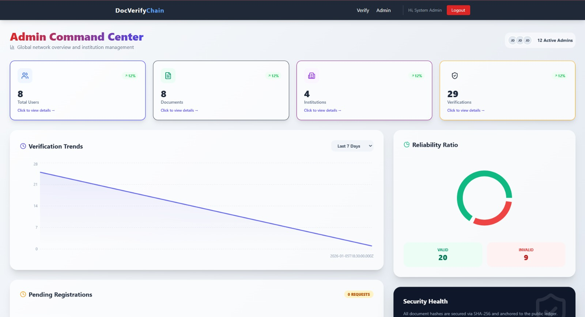

# 🔐 Blockchain-Based Document Verification System

A full-stack decentralized platform to verify document authenticity using **SHA-256 hashing + Ethereum blockchain anchoring**, ensuring tamper-proof validation and transparent verification.

---

## 🚀 Key Highlights

- ⛓️ Blockchain-backed document verification (Ethereum + Hardhat + Ganache)
- 🔐 SHA-256 hashing for tamper-proof integrity
- 👥 Role-based system (Admin / Uploader / Verifier)
- 🏛️ Institution approval workflow (real-world simulation)
- 📄 QR-based certificate & proof generation (PDF + JSON)
- 📊 Admin analytics dashboard
- ⚡ End-to-end system across frontend, backend, DB, and blockchain

---

## 📸 Screenshots

> Add your images here (very important)

### Upload Dashboard
### Admin Dashboard


### Verification Result


---

## 🧠 What Problem Does It Solve?

Traditional document verification systems suffer from:
- forged certificates
- centralized and mutable records
- lack of transparency for third-party verification

This system solves it using:
- **cryptographic hashing → ensures integrity**
- **blockchain anchoring → ensures immutability**
- **verification certificates → ensures trust**

---

## 🏗️ Architecture Overview

Frontend (React) → Backend (Node.js) → MySQL  
                             ↓  
                     Ethereum Blockchain

## Overview
This project is a full-stack document verification platform that combines:

- a React frontend for upload, admin, and verification workflows
- a Node.js and Express backend for authentication, document handling, analytics, and certificate generation
- a MySQL database for users, institutions, document metadata, verification logs, and proof records
- an Ethereum-compatible smart contract for immutable document-hash anchoring
- a local blockchain development setup using **Ganache** and **Hardhat**

The core idea is simple: the system never needs to store original documents permanently to prove authenticity. Instead, it hashes uploaded files using SHA-256, anchors the hash on-chain, stores supporting metadata in MySQL, and later verifies uploaded files by recomputing the hash and checking both blockchain and database state.

This repository is strong as an academic or portfolio-grade end-to-end project. It demonstrates real implementation depth across frontend, backend, database, and blockchain layers.

## Problem Statement
Traditional document verification systems often rely on manual checks or mutable centralized records. That creates problems such as:

- forged certificates and transcripts
- difficulty proving that a document is unchanged
- lack of transparent verification for third parties
- administrative overhead for institutions

This system addresses those issues by combining:

- **cryptographic hashing** for document fingerprints
- **blockchain anchoring** for immutability
- **role-based workflows** for institution and admin control
- **tamper-evident verification certificates** for public verification

## High-Level Architecture

### 1. Frontend
Located in [`client/`](/C:/Users/shreeram/Documents/docverify/client).

Built with:

- React 19
- Vite
- Tailwind CSS
- Axios
- React Router
- Framer Motion
- Recharts
- Lucide icons

Main frontend responsibilities:

- user login and signup
- uploader dashboard for document anchoring and institution status
- admin dashboard for institution approvals and analytics
- public verifier page for file verification
- public proof/certificate verification page

### 2. Backend
Located in [`server/`](/C:/Users/shreeram/Documents/docverify/server).

Built with:

- Node.js
- Express
- mysql2
- jsonwebtoken
- bcrypt
- multer
- helmet
- cors
- express-rate-limit
- web3
- pdfkit
- qrcode

Main backend responsibilities:

- authentication and JWT issuance
- institution approval workflow
- document upload and SHA-256 hashing
- blockchain anchoring and verification
- verification logging
- proof and certificate generation
- admin analytics and institution lifecycle actions

### 3. Database
Located in [`database/`](/C:/Users/shreeram/Documents/docverify/database).

Uses MySQL and stores:

- users
- institutions
- institution requests
- documents
- revocation records
- verification logs
- proof objects
- generated certificate metadata
- audit-related data structures

### 4. Blockchain
Located in [`blockchain/`](/C:/Users/shreeram/Documents/docverify/blockchain).

Uses:

- Solidity
- Hardhat
- Ganache
- Ethers / Hardhat toolbox

The smart contract anchors the document hash and stores immutable issuance metadata such as issuer address, timestamp, block number, and revocation state.

## Folder Structure

```text
client/       React + Vite frontend
server/       Express backend and business logic
blockchain/   Hardhat project and Solidity contract
database/     MySQL schema and seed scripts
certificates/ Generated certificate output directory
```

Important files:

- [`client/src/pages/Verifier.jsx`](/C:/Users/shreeram/Documents/docverify/client/src/pages/Verifier.jsx)
- [`client/src/pages/UploaderDashboard.jsx`](/C:/Users/shreeram/Documents/docverify/client/src/pages/UploaderDashboard.jsx)
- [`client/src/pages/AdminDashboard.jsx`](/C:/Users/shreeram/Documents/docverify/client/src/pages/AdminDashboard.jsx)
- [`client/src/pages/ProofVerification.jsx`](/C:/Users/shreeram/Documents/docverify/client/src/pages/ProofVerification.jsx)
- [`server/server.js`](/C:/Users/shreeram/Documents/docverify/server/server.js)
- [`server/controllers/documentController.js`](/C:/Users/shreeram/Documents/docverify/server/controllers/documentController.js)
- [`server/controllers/authController.js`](/C:/Users/shreeram/Documents/docverify/server/controllers/authController.js)
- [`server/controllers/adminController.js`](/C:/Users/shreeram/Documents/docverify/server/controllers/adminController.js)
- [`server/controllers/proofController.js`](/C:/Users/shreeram/Documents/docverify/server/controllers/proofController.js)
- [`server/controllers/certificateController.js`](/C:/Users/shreeram/Documents/docverify/server/controllers/certificateController.js)
- [`server/utils/blockchain.js`](/C:/Users/shreeram/Documents/docverify/server/utils/blockchain.js)
- [`server/utils/proofGenerator.js`](/C:/Users/shreeram/Documents/docverify/server/utils/proofGenerator.js)
- [`database/schema.sql`](/C:/Users/shreeram/Documents/docverify/database/schema.sql)
- [`blockchain/contracts/DocumentRegistry.sol`](/C:/Users/shreeram/Documents/docverify/blockchain/contracts/DocumentRegistry.sol)

## Technology Stack

### Frontend Dependencies

- `react`
- `react-dom`
- `react-router-dom`
- `axios`
- `framer-motion`
- `recharts`
- `lucide-react`
- `vite`
- `tailwindcss`
- `eslint`

### Backend Dependencies

- `express`
- `mysql2`
- `bcrypt`
- `jsonwebtoken`
- `multer`
- `cors`
- `helmet`
- `morgan`
- `express-rate-limit`
- `web3`
- `pdfkit`
- `qrcode`
- `dotenv`

### Blockchain Dependencies

- `hardhat`
- `@nomicfoundation/hardhat-toolbox`
- `ethers`
- `typechain`
- `typescript`

### External Software / Runtime Dependencies
To run the project properly end-to-end, you should have:

- **Node.js 20+** recommended
- **npm**
- **MySQL 8+**
- **Ganache** desktop or CLI
- **Git**
- optionally **Docker Desktop** for containerized setup
- optionally **GitHub CLI (`gh`)** if you want to automate pushes, PRs, or repo settings

## Why Ganache Is Needed
Ganache is the local Ethereum-compatible blockchain used during development.

It provides:

- local accounts with private keys
- instant mining
- predictable testing environment
- a local RPC endpoint, usually `http://127.0.0.1:7545`

This project’s Hardhat config is already aimed at Ganache:

- network name: `ganache`
- default RPC URL: `http://127.0.0.1:7545`
- chain ID: `1337`

In this architecture:

1. Ganache runs a local blockchain.
2. Hardhat deploys the `DocumentRegistry` smart contract to Ganache.
3. The Express backend connects to Ganache using Web3.
4. The backend calls contract methods to anchor and verify document hashes.

Without Ganache or another compatible local chain, the blockchain layer will not function.

## Smart Contract Implementation
The main contract is [`DocumentRegistry.sol`](/C:/Users/shreeram/Documents/docverify/blockchain/contracts/DocumentRegistry.sol).

### Contract Responsibilities

- store document hashes as immutable blockchain records
- associate each hash with an issuer address
- record timestamp and block number
- allow revocation by the original issuer
- expose verification data for backend validation

### Key Contract Methods

- `anchorDocument(bytes32 _docHash)`
  Anchors a new document hash on-chain.

- `verifyDocument(bytes32 _docHash)`
  Returns on-chain metadata for a document hash.

- `revokeDocument(bytes32 _docHash, string memory _reason)`
  Marks an anchored document as revoked.

### Contract Events

- `DocumentAnchored`
- `DocumentRevoked`

These events help with traceability and are useful for blockchain-side auditing.

## Backend Implementation Details

### Authentication Flow
Files:

- [`server/controllers/authController.js`](/C:/Users/shreeram/Documents/docverify/server/controllers/authController.js)
- [`server/middlewares/authMiddleware.js`](/C:/Users/shreeram/Documents/docverify/server/middlewares/authMiddleware.js)

Implementation summary:

- users register with `name`, `email`, `password`, and `role`
- passwords are hashed with `bcrypt`
- JWT tokens are generated after login/registration
- protected routes use `Bearer` tokens
- middleware re-fetches the latest user row from MySQL to avoid stale role or institution data

Supported roles:

- `admin`
- `uploader`
- `verifier`

### Institution Approval Workflow
Files:

- [`server/controllers/institutionController.js`](/C:/Users/shreeram/Documents/docverify/server/controllers/institutionController.js)
- [`server/controllers/adminController.js`](/C:/Users/shreeram/Documents/docverify/server/controllers/adminController.js)

Flow:

1. An uploader signs up.
2. The uploader submits institution details.
3. A row is created in `institution_requests`.
4. An admin reviews pending requests.
5. On approval:
   - a new institution row is created
   - the uploader is linked to that institution
6. On rejection:
   - the request is marked rejected with an optional reason

This gives the project a more realistic workflow than direct open uploads.

### Document Upload and Hash Anchoring
File:

- [`server/controllers/documentController.js`](/C:/Users/shreeram/Documents/docverify/server/controllers/documentController.js)

Upload pipeline:

1. Authenticated uploader submits a file.
2. Multer stores it temporarily in `uploads/`.
3. The backend reads the file and computes a SHA-256 hash.
4. The hash is prefixed with `0x` so it can be used with Solidity `bytes32`.
5. The backend checks:
   - whether the hash already exists in MySQL
   - whether the hash is already anchored on-chain
6. If new, the backend anchors it through Web3.
7. MySQL stores document metadata:
   - uploader
   - institution
   - filename
   - original hash
   - blockchain transaction hash
   - block number
   - expiry date
8. The temporary upload file is deleted.

This design avoids long-term storage of the original uploaded document while preserving verifiability.

### Blockchain Integration in Backend
File:

- [`server/utils/blockchain.js`](/C:/Users/shreeram/Documents/docverify/server/utils/blockchain.js)

Implementation details:

- connects to `BLOCKCHAIN_RPC_URL`
- loads contract ABI from Hardhat artifacts
- reads `CONTRACT_ADDRESS` from environment
- optionally uses a configured private key
- otherwise can use unlocked local Ganache accounts
- exposes:
  - `anchorHash(docHash)`
  - `verifyHash(docHash)`

### Verification Flow
File:

- [`server/controllers/documentController.js`](/C:/Users/shreeram/Documents/docverify/server/controllers/documentController.js)

Verification pipeline:

1. A user uploads a file for verification.
2. The backend hashes the file again.
3. The hash is checked on-chain through the smart contract.
4. The backend cross-checks MySQL document metadata.
5. The system evaluates:
   - whether the document exists
   - whether it is still active
   - whether it is expired
   - whether it has been revoked
6. A verification record is inserted into `verifications`.
7. For valid results, a cryptographic proof object is generated.
8. That proof is persisted and can be downloaded as PDF or JSON.

### Proof Object Generation
File:

- [`server/utils/proofGenerator.js`](/C:/Users/shreeram/Documents/docverify/server/utils/proofGenerator.js)

This module:

- builds a deterministic JSON-like object
- sorts keys consistently
- serializes data deterministically
- computes a SHA-256 proof hash

The purpose is to make proof generation tamper-evident and reproducible.

Proof objects include:

- document hash
- institution name
- verification result
- verification timestamp
- blockchain transaction hash
- block number
- verifier type
- expiry date
- system version

### Certificate Generation
Files:

- [`server/services/certificateService.js`](/C:/Users/shreeram/Documents/docverify/server/services/certificateService.js)
- [`server/controllers/certificateController.js`](/C:/Users/shreeram/Documents/docverify/server/controllers/certificateController.js)
- [`server/controllers/proofController.js`](/C:/Users/shreeram/Documents/docverify/server/controllers/proofController.js)

Certificate features:

- PDF certificate generation using PDFKit
- QR code embedding using `qrcode`
- JSON export for machine-readable verification
- public proof hash verification endpoint
- certificate preview endpoint

Generated certificate output is stored under the `certificates/` directory.

### Rate Limiting and Security Middleware
Files:

- [`server/middlewares/rateLimiter.js`](/C:/Users/shreeram/Documents/docverify/server/middlewares/rateLimiter.js)
- [`server/server.js`](/C:/Users/shreeram/Documents/docverify/server/server.js)

Security-related features currently implemented:

- `helmet` for secure response headers
- `cors`
- `express-rate-limit` for public verification and certificate download endpoints
- JWT-protected uploader/admin routes
- bcrypt password hashing

## Database Schema
Primary schema file:

- [`database/schema.sql`](/C:/Users/shreeram/Documents/docverify/database/schema.sql)

Main tables:

- `institutions`
- `users`
- `institution_requests`
- `documents`
- `revoked_documents`
- `verifications`
- `verification_proofs`
- `verification_certificates`
- `audit_logs`

### Why These Tables Exist

- `users`
  Stores identity, login, role, and optional institution linkage.

- `institutions`
  Stores institutional identity and status.

- `institution_requests`
  Supports approval workflow before uploader activation.

- `documents`
  Stores anchored document metadata and lifecycle state.

- `revoked_documents`
  Records why a document became invalid.

- `verifications`
  Logs each verification attempt.

- `verification_proofs`
  Stores deterministic proof objects and their proof hashes.

- `verification_certificates`
  Stores PDF/JSON certificate metadata and access URLs.

## Frontend Implementation Details

### Routing
File:

- [`client/src/App.jsx`](/C:/Users/shreeram/Documents/docverify/client/src/App.jsx)

Routes include:

- `/verifier`
- `/login`
- `/signup`
- `/uploader`
- `/admin`
- `/verify-proof/:proofHash`

### Auth Context
File:

- [`client/src/context/AuthContext.jsx`](/C:/Users/shreeram/Documents/docverify/client/src/context/AuthContext.jsx)

Responsibilities:

- persist JWT in local storage
- decode token on app startup
- handle login/logout/register
- navigate users to role-appropriate dashboards

### API Layer
File:

- [`client/src/api/axios.js`](/C:/Users/shreeram/Documents/docverify/client/src/api/axios.js)

Details:

- frontend uses relative `/api` paths
- Axios automatically attaches bearer tokens if present
- Vite dev server proxies `/api` to backend during local development

### Uploader Dashboard
File:

- [`client/src/pages/UploaderDashboard.jsx`](/C:/Users/shreeram/Documents/docverify/client/src/pages/UploaderDashboard.jsx)

Features:

- view institution approval status
- submit institution request
- upload and anchor documents
- optional expiry date assignment
- view documents and verification history

### Admin Dashboard
File:

- [`client/src/pages/AdminDashboard.jsx`](/C:/Users/shreeram/Documents/docverify/client/src/pages/AdminDashboard.jsx)

Features:

- approve or reject institution requests
- view users, institutions, documents, and verifications
- deactivate or reactivate institutions
- monitor verification trends and ratios

### Public Verifier
File:

- [`client/src/pages/Verifier.jsx`](/C:/Users/shreeram/Documents/docverify/client/src/pages/Verifier.jsx)

Features:

- upload a file without admin/uploader permissions
- view authenticity result
- inspect institution and timestamp metadata
- download proof certificates if verification is valid

### Proof Verification Page
File:

- [`client/src/pages/ProofVerification.jsx`](/C:/Users/shreeram/Documents/docverify/client/src/pages/ProofVerification.jsx)

Features:

- verify a certificate using only its proof hash
- detect proof tampering
- show expiry status
- expose blockchain and certificate metadata

## Local Development Setup

## 1. Clone the Repository

```powershell
git clone https://github.com/shreeram675/newdbms.git
cd newdbms
```

## 2. Database Setup
Install MySQL and create the database:

```sql
CREATE DATABASE doc_verify_db;
```

Then import:

```powershell
mysql -u root -p doc_verify_db < database/schema.sql
mysql -u root -p doc_verify_db < database/seed.sql
```

## 3. Ganache Setup

### Option A: Ganache Desktop
1. Install Ganache.
2. Create a new workspace or quickstart chain.
3. Ensure it runs on:
   - host: `127.0.0.1`
   - port: `7545`
4. Copy one account private key if you want the backend to sign transactions directly.

### Option B: Ganache CLI

```powershell
ganache --port 7545 --chain.chainId 1337
```

## 4. Smart Contract Deployment

```powershell
cd blockchain
npm install
npx hardhat compile
npx hardhat run scripts/deploy.cjs --network ganache
```

After deployment, copy the logged contract address into `server/.env`.

## 5. Backend Setup
Create `server/.env` with values like:

```env
PORT=5000
DB_HOST=localhost
DB_PORT=3306
DB_USER=root
DB_PASSWORD=your_password
DB_NAME=doc_verify_db
JWT_SECRET=replace_with_a_real_secret
BLOCKCHAIN_RPC_URL=http://127.0.0.1:7545
CONTRACT_ADDRESS=0xYourDeployedContractAddress
PRIVATE_KEY=0xYourGanachePrivateKey
FRONTEND_URL=http://localhost:5173
```

Then run:

```powershell
cd server
npm install
npm start
```

## 6. Frontend Setup

```powershell
cd client
npm install
npm run dev
```

Default local addresses:

- frontend: [http://localhost:5173](http://localhost:5173)
- backend: [http://localhost:5000](http://localhost:5000)
- Ganache RPC: `http://127.0.0.1:7545`

## Docker Setup
Containerized setup is available through [`docker-compose.yml`](/C:/Users/shreeram/Documents/docverify/docker-compose.yml).

### What Docker Compose Starts

- MySQL 8
- Express backend
- React frontend served through Nginx

### Run It

```powershell
docker-compose up --build
```

### Service Ports

- frontend: `3000`
- backend: `5000`
- MySQL host port: `3307`

### Important Note About Blockchain With Docker
The Docker setup assumes the blockchain node still runs outside the containers, exposed as:

`http://host.docker.internal:7545`

That means Ganache should still be running on the host machine when using Docker Compose.

## NPM Scripts

### Client
- `npm run dev`
- `npm run build`
- `npm run preview`
- `npm run lint`

### Server
- `npm start`

### Blockchain
Common commands:

```powershell
npx hardhat compile
npx hardhat run scripts/deploy.cjs --network ganache
```

## API Summary

### Auth
- `POST /api/auth/register`
- `POST /api/auth/login`

### Institutions
- `POST /api/institutions/request`
- `GET /api/institutions/my-status`
- `GET /api/institutions/:id`

### Admin
- `GET /api/admin/institution-requests`
- `POST /api/admin/institution-requests/:id/approve`
- `POST /api/admin/institution-requests/:id/reject`
- `GET /api/admin/stats`
- `POST /api/admin/institutions/:id/deactivate`
- `POST /api/admin/institutions/:id/reactivate`

### Documents
- `POST /api/documents/upload`
- `POST /api/documents/verify`
- `GET /api/documents/stats`
- `POST /api/documents/:id/revoke`

### Certificates / Proofs
- `GET /api/certificates/download/:proofHash`
- `GET /api/certificates/json/:proofHash`
- `GET /api/certificates/preview/:proofHash`
- `GET /api/certificates/verify/:proofHash`
- `GET /api/certificates/stats`

## Validation / Checks Performed
Recent validation on this repository included:

- backend Node syntax checks on touched files
- frontend production build through Vite
- Hardhat contract compile

## Current Strengths

- real end-to-end implementation across 4 layers
- non-trivial workflow design with admin approval and role control
- blockchain + database coordination
- proof hashing and certificate generation
- public verification capability
- Docker support

## Current Limitations
This project is strong, but it is not claiming full enterprise production readiness.

Areas still worth improving:

- formal automated tests across all layers
- full migration management for schema evolution
- more robust secrets handling
- stricter validation and centralized error responses
- richer audit logging
- optional support for a public blockchain explorer or production chain deployment
- dependency vulnerability cleanup in frontend packages

## Resume-Friendly Description
You can describe this project like this:

> Built a blockchain-based document verification platform using React, Node.js, Express, MySQL, Solidity, Hardhat, and Ganache, implementing SHA-256 document hashing, role-based access control, institution approval workflows, blockchain anchoring, and tamper-evident verification certificates.

## License
No explicit license is currently defined in this repository. Add one if you want clearer reuse terms.
